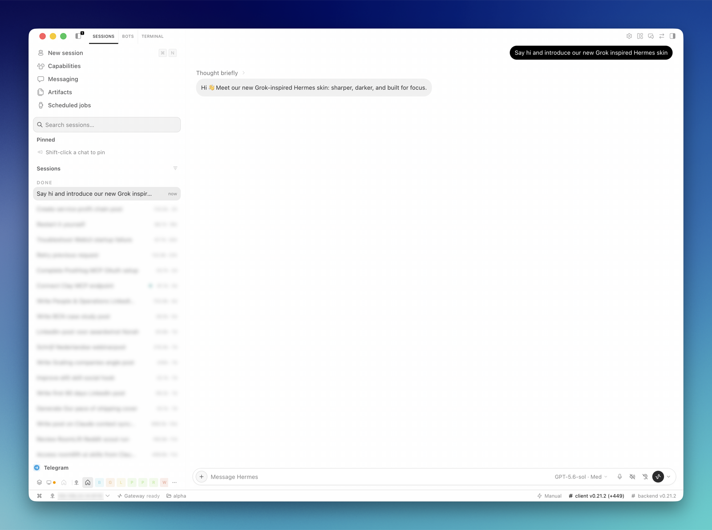
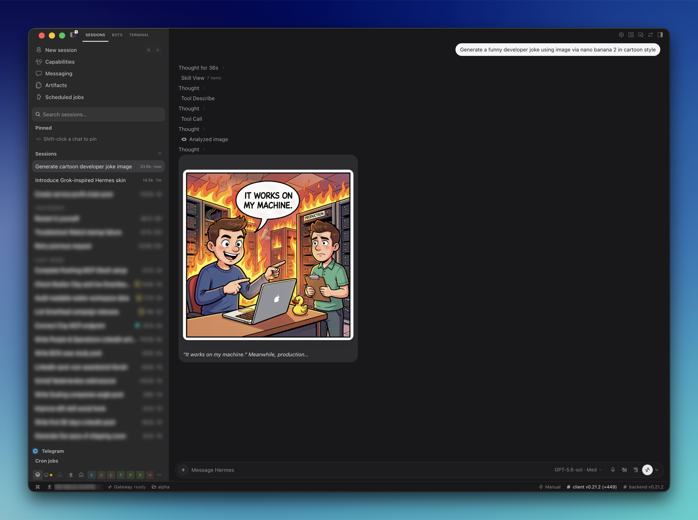
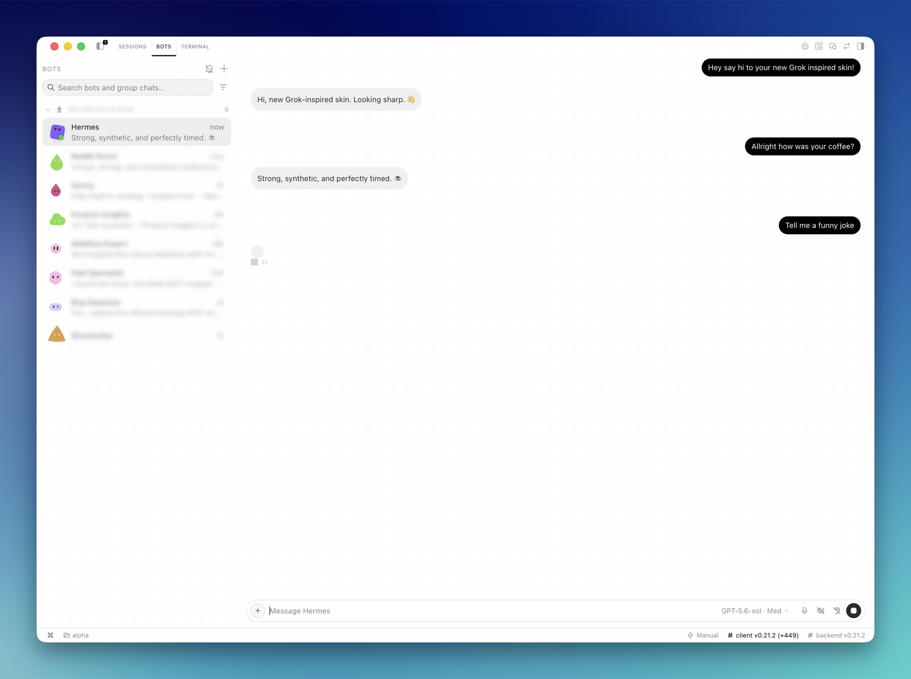
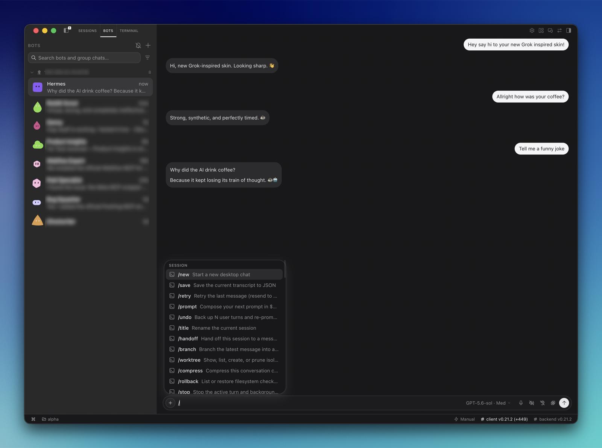

# Grok Skin for Hermes Desktop

A Grok Bot–inspired skin for Hermes Desktop. It restyles the chat, composer,
sidebar and Bots view with white surfaces, soft gray message pills, a black
prompt pill and rounder corners throughout, while leaving Hermes' behavior
untouched.



> [!IMPORTANT]
> This is an independent community plugin inspired by the look of Grok Bot. It is
> not affiliated with, endorsed by or connected to xAI or Nous Research. "Grok"
> is a trademark of its owner and is used here only to describe the visual
> inspiration.

## Status

**Early.** Tested in Hermes Desktop in light and dark mode. The skin targets
Hermes' `data-slot` attributes wherever it can, and falls back to some internal
class names and English labels where Hermes offers no attribute. None of these
are a public API, so a future Hermes release can require selector updates.

## What it changes

**Transcript**

- Each part of a reply is its own gray pill, stacked closely together
- Your prompts are solid black pills with white text; their Stop and Restore
  buttons appear just below the pill on hover
- Tool calls sit in matching gray pills
- Message actions use larger icons on rounded targets with a soft hover, with the
  reaction first and the time at the far right
- Tooltips are one rounded bubble, even when the text wraps

**Composer**

- A white rounded field with a ringed `+` and a round send button
- The hint reads "Message" plus the open bot's name; Hermes' connection hints
  such as "Reconnecting to Hermes…" still show
- Menus, submenus and popovers get rounder corners, a soft shadow and neutral
  gray rounded hover rows, including the model menu

**Sidebar**

- A gray sidebar with a full-width search field
- Section labels such as Pinned, Sessions and Cron jobs in sentence case, without
  Hermes' checkerboard marker or the rule after date headings
- Session rows reach the sidebar edge, with dots only when they mean something:
  a session color or a live state, shown at the end of the row, and running
  sessions in green

**Bots view**

- Compact avatars with clear titles and message previews
- A green dot on the avatar only while that bot is working
- An orange dot and amber preview while a bot is waiting on you

**Everywhere**

- A **Grok Skin** theme in **Settings → Appearance** with a white and gray light
  palette and a matching dark palette. Selecting it turns the whole skin on
- The system font, and rounder corners app-wide

## Screenshots

| Light | Dark |
| --- | --- |
|  |  |
| **Sessions:** prompt and reply pills, sentence-case sections | **Sessions:** tool call rows and a generated image |
|  |  |
| **Bots:** a green dot while Hermes is working | **Bots:** the slash command menu above the composer |

## Requirements

- Hermes Desktop with desktop plugin support (**Settings → Plugins**)
- English as the Hermes language for the status and composer-hint details; the
  rest of the skin works in any language

## Install

### 1. Add the plugin

**From Hermes Desktop (recommended).** Open **Settings → Plugins → Install
plugin** and paste:

```text
guidsen/hermes-grok-bot-skin/grok-chat-look
```

Keep the `/grok-chat-look` suffix: the plugin lives in that folder.

<details>
<summary><strong>Manual install on macOS or Linux</strong></summary>

```sh
PLUGIN_DIR="${HERMES_HOME:-$HOME/.hermes}/desktop-plugins/grok-chat-look"
mkdir -p "$PLUGIN_DIR"
curl -fsSL \
  https://raw.githubusercontent.com/guidsen/hermes-grok-bot-skin/main/grok-chat-look/plugin.js \
  -o "$PLUGIN_DIR/plugin.js"
```

For a named profile, use
`~/.hermes/profiles/<profile>/desktop-plugins/grok-chat-look/plugin.js`.

</details>

<details>
<summary><strong>Manual install on Windows (PowerShell)</strong></summary>

```powershell
$pluginDir = Join-Path $HOME ".hermes\desktop-plugins\grok-chat-look"
New-Item -ItemType Directory -Force -Path $pluginDir | Out-Null
Invoke-WebRequest `
  -Uri "https://raw.githubusercontent.com/guidsen/hermes-grok-bot-skin/main/grok-chat-look/plugin.js" `
  -OutFile (Join-Path $pluginDir "plugin.js")
```

</details>

Hermes watches the plugin folder and loads the file automatically.

### 2. Turn it on

Open **Settings → Appearance** and pick **Grok Skin**. The skin is tied to its
theme: choosing any other theme restores Hermes' own look, and switching back
brings the skin back without a reload.

### Troubleshooting

- **Nothing changes after installing.** Check that **Grok Skin** is enabled under
  **Settings → Plugins** and selected under **Settings → Appearance**. If it
  still does not show, run **Reload desktop plugins** from the command palette.
- **`Unexpected token '<'`.** The file saved is a GitHub web page, not the
  plugin. Use the install path above or the `raw.githubusercontent.com` URL,
  never a `github.com/.../blob/...` link.

## Settings

| Setting | Values | Default | Where |
| --- | --- | --- | --- |
| Grok Skin | On / Off | On after installation | **Settings → Plugins** |
| Theme | Grok Skin turns the skin on; any other theme turns it off | Hermes choice | **Settings → Appearance** |
| Chat width | Full / Centered | Full | Command palette |
| Pinned user messages | Off / Hermes | Off | Command palette |

## Update

Run the install again. Hermes hot-reloads the replaced file.

## Uninstall

Disable **Grok Skin** under **Settings → Plugins**, then remove its folder:

```sh
rm -rf "${HERMES_HOME:-$HOME/.hermes}/desktop-plugins/grok-chat-look"
```

On Windows (PowerShell):

```powershell
Remove-Item -Recurse -Force (Join-Path $HOME ".hermes\desktop-plugins\grok-chat-look")
```

## Known limits

- Session and bot status, and the composer hint, are matched on Hermes' English
  labels, so those parts only apply with Hermes set to English.
- Some details need markup Hermes does not render, such as a per-bot chat header
  or a status badge on tool cards.

## What it does not do

- It does not change Hermes' model, thinking or session behavior.
- It does not modify Hermes source files.
- It makes no network requests and loads no external assets.

## Privacy and authority

Desktop plugins run inside the Hermes renderer with the same authority as the
app, so review any plugin before installing it. This one stores only its two
settings locally and never reads or stores message content.

## Development

```sh
npm test
```

The tests run `plugin.js` in a sandbox with a stubbed plugin SDK. They check that
every rule stays scoped to the skin, that colors come from theme tokens, and that
the measured geometry in [`docs/reference-spec.md`](docs/reference-spec.md) holds.

## Credits

Built by [Guido Schmitz](https://github.com/guidsen).

## License

[MIT](LICENSE) © Guido Schmitz
